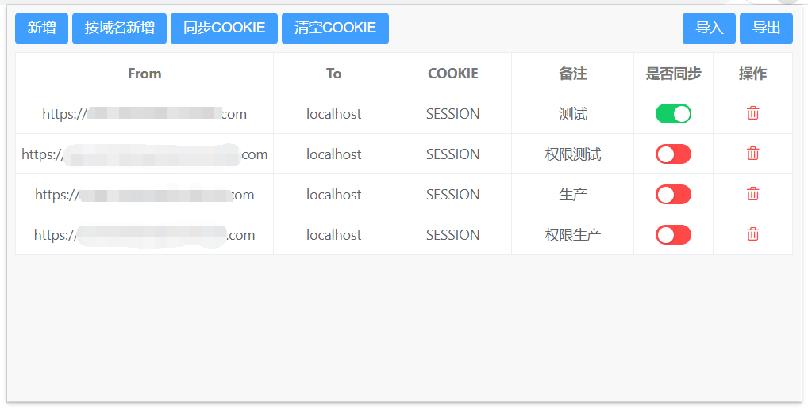

## COOKIE 跨域同步

`解决开发环境跨域cookie自动携带问题`

---

### 原理

chrome 插件可以突破跨域的限制，获取到不同域名下的 cookie `chrome.cookies.get` 和 `chrome.cookies.set`

### 安装

1. 打开 chrome 浏览器
2. 把 dist 目录下的 crx 扩展程序拖拽至 chrome 里
3. 或者打开扩展程序(或者点击 [chrome://extensions/](chrome://extensions/) 打开)，选中开发者模式，加载已经解压的扩展程序，选择当前文件夹
4. 在 [chrome://extensions/](chrome://extensions/) 页面，点击左上角配置，选择键盘快捷键，给该扩展程序配置个 `Alt + C` 快捷键

### 用法

1. chrome 浏览器登录测试环境页面
2. 点击该扩展程序，新增测试环境域名、cookie 字段名称
3. 启动开发环境，刷新页面即可

### 技术选型

1. 使用 petite-vue 轻量驱动开发

### 免责声明

**1. 本仓库发布的程序代码及其中涉及的任何解锁和解密分析程序，仅用于测试和学习研究，禁止用于商业用途，不能保证其合法性，准确性，完整性和有效性，请根据情况自行判断。**

**2. 本人对任何程序问题概不负责，包括但不限于由任何程序错误导致的任何损失或损害。**

**3. 间接使用程序的任何用户，建立 VPS 或在某些行为违反国家/地区法律或相关法规的情况下进行传播，本人对于由此引起的任何隐私泄漏或其他后果概不负责。**

**4. 请勿将本仓库的任何内容用于商业或非法目的，否则后果自负。**

**5. 如果任何单位或个人认为该项目的程序可能涉嫌侵犯其权利，则应及时通知并提供身份证明、所有权证明，我们将在收到认证文件后删除相关程序。**

**6. 任何以任何方式查看此项目的人或直接或间接使用该项目的任何程序的使用者都应仔细阅读此声明。本人保留随时更改或补充此免责声明的权利。一旦使用并复制了任何相关程序或 Script 项目的规则，则视为您已接受此免责声明。**

**7. 您必须在下载任何内容后的 24 小时内从您的存储设备中完全删除下载的内容。**

**8. 您使用或者复制了本仓库和本人制作的任何程序，则视为 `已接受` 此声明，请仔细阅读，谢谢！**

**9. 本仓库程序和打包的插件仅用于学习和测试，也请在完成之前，仔细阅读特别声明，完成后，删除程序和插件，谢谢！**
